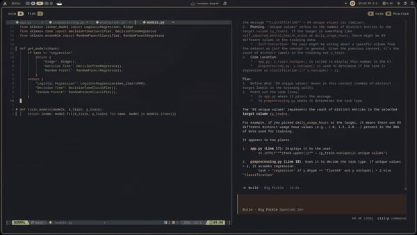

# ML Model Comparison App

A simple Streamlit app that automatically trains and compares machine learning models on your dataset.

## Demo



## Features

- Upload any CSV dataset
- Automatic task detection (classification or regression)
- Trains 3 models simultaneously:
  - Linear Model (Ridge/Logistic Regression)
  - Decision Tree
  - Random Forest
- Compares model performance with metrics
- Visual results with bar charts

## Installation

```bash
git clone <repo-url>
cd project
uv sync
```

## Usage

```bash
streamlit run app.py
```

1. Open the app in your browser
2. Upload a CSV file
3. Select the target column
4. Click "Run" to train and compare models

## Project Structure

```
├── app.py              # Streamlit web app
├── models.py           # Model definitions and training
├── preprocessing.py    # Data preprocessing pipeline
├── evaluation.py       # Model evaluation metrics
└── datasets/          # Sample datasets
```

## Dependencies

- streamlit
- pandas
- scikit-learn
